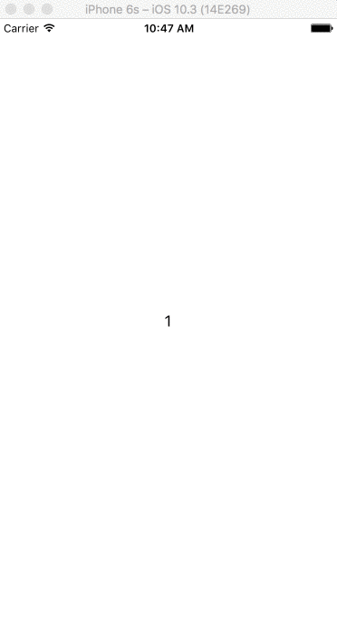

# ViewControllerPager

[](https://developer.apple.com/iphone/index.action)
[](https://developer.apple.com/swift)
[](http://mit-license.org)



# Installation
### CocoaPods
In your `Podfile`:
```
pod "ViewControllerPager"
```
And in your `*.swift`:
```swift
import ViewControllerPager
```

# Usage
### set Delegate
```swift
class ViewController: ViewControllerPagerDelegate, ViewControllerPagerDataSource {

    @IBOutlet weak var viewControllerPager: ViewControllerPager!

    override func viewDidLoad() {
        super.viewDidLoad()

        viewControllerPager.dataSource = self
        viewControllerPager.delegate = self

        viewControllerPager.reloadPages()
    }
}

```
### ViewControllerPagerDataSource
```swift
// set pages
func pageViewController(_ viewControllerPager: ViewControllerPager, index: Int) -> PageViewController?
func pageCount(_ viewControllerPager: ViewControllerPager) -> Int
```

### ViewControllerPagerDelegate
```swift
// page change event
@objc optional func didAppearPage(_ viewControllerPager: ViewControllerPager, index: Int)
@objc optional func didDisAppearPage(_ viewControllerPager: ViewControllerPager, index: Int)
```

### Functions
```swift
// be returned PageViewController for reuse
func dequeueReuseablePageWithIdentifier(_ identifier: String) -> PageViewController?
```
